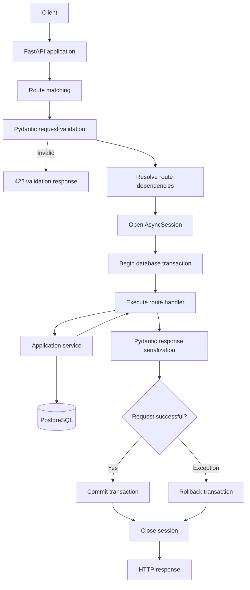
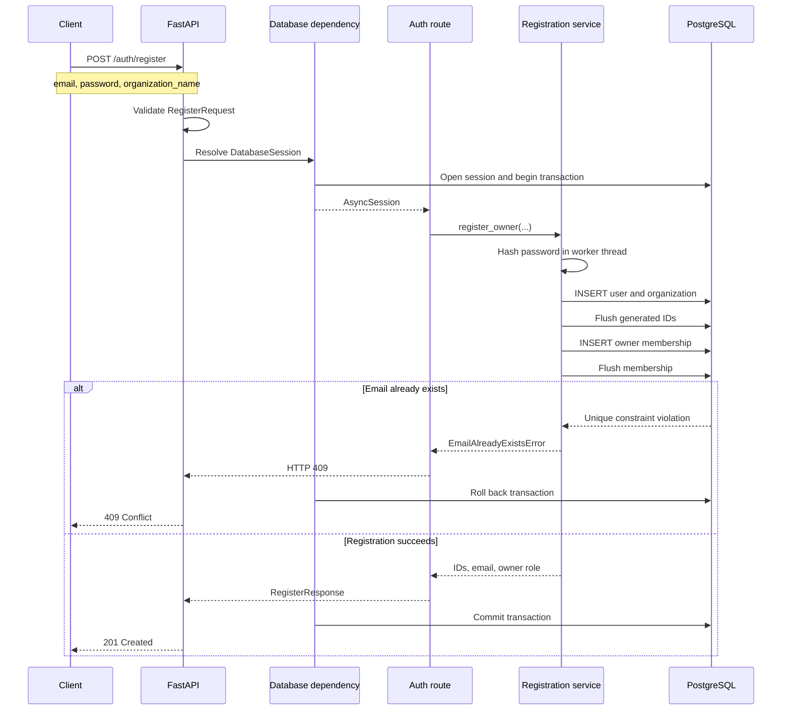
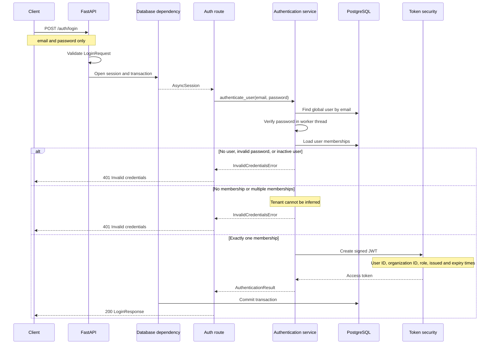
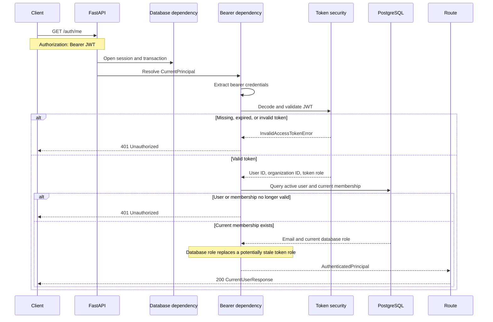
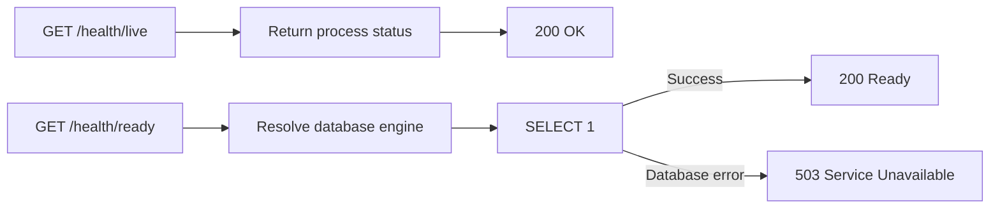

# Current API call lifecycle

Status: Current implementation  
Last updated: 2026-09-22

## Overall lifecycle



## Registration



## Login

Organization selection is not currently accepted. The sole membership is
inferred.



Current login response:

```json
{
  "user_id": "uuid",
  "organization_id": "uuid",
  "email": "user@example.com",
  "role": "owner",
  "access_token": "jwt"
}
```

## Authenticated request

The current authenticated endpoint is `GET /auth/me`.



## Health endpoints



## Planned lifecycle change

The next tenant-isolation slice will establish transaction-local tenant context
after principal validation and before tenant-owned queries. PostgreSQL RLS will
then enforce that context for tenant-owned tables.
