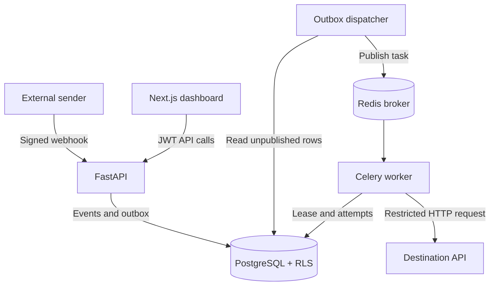
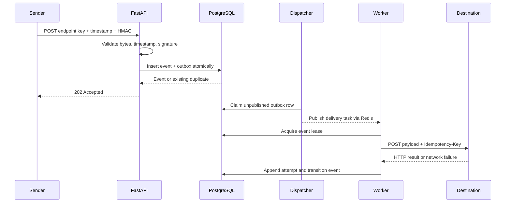

# RelayMaid architecture

Status: Draft 1 — ready for review

## System overview



## Main ingestion sequence



## Data ownership

Tenant-owned entities are linked using composite tenant-aware foreign keys:

```text
Organization
  ├── User
  └── WebhookEndpoint
        └── Event
              ├── DeliveryAttempt
              └── OutboxMessage
```

Every tenant-owned child carries `organization_id` even when it could be derived
through a parent. The duplication makes RLS direct and enables database-level
composite foreign keys that prevent cross-tenant relationships.

## Database roles

Initial role model:

- `relaymaid_owner`: owns schema objects and is used only by migrations.
- `relaymaid_app`: used by dashboard and tenant-scoped application queries;
  not owner and no `BYPASSRLS`.
- `relaymaid_worker`: proposed narrowly privileged role for outbox/recovery work.

The worker role remains a proposed decision. We must determine whether it should
process one tenant at a time through normal RLS or receive narrowly constrained
cross-tenant functions. A blanket `BYPASSRLS` worker role is not acceptable.

## Transaction boundaries

1. Dashboard request: begin transaction, set local tenant context, execute work,
   commit/rollback, then return connection to pool.
2. Ingestion: restricted endpoint lookup, HMAC verification, then one tenant-bound
   transaction creates event and outbox row.
3. Dispatch: claim outbox rows in short transactions; duplicate publication is safe.
4. Delivery: acquire durable ownership, perform bounded HTTP I/O, then persist the
   result. Exact lease transactions will be fixed in a later ADR.

Holding a database transaction open across outbound HTTP would simplify locking
but waste connections and keep locks for an unbounded external operation. The
preferred design uses a durable lease and short database transactions instead.

## Proposed technology baseline

- Python 3.13, FastAPI, Pydantic v2.
- SQLAlchemy 2.x, Alembic, PostgreSQL 17, psycopg 3.
- Celery and Redis.
- HTTPX through a dedicated outbound security boundary.
- Next.js App Router and TypeScript.
- pytest, Ruff, mypy, pre-commit, Docker Compose, GitHub Actions.

Versions are proposed rather than locked until the runnable skeleton is created.

## Decisions still requiring review

1. Worker database authorization model for cross-tenant scheduling.
2. Exact public endpoint lookup mechanism without broad RLS bypass.
3. Secret encryption/key management interface for local and deployed environments.
4. Delivery lease schema and uncertain-outcome recovery behavior.
5. Retry defaults and exact status-code policy.
6. Whether login emails are globally unique or organization-scoped.
7. Hosting platform and infrastructure egress controls.

