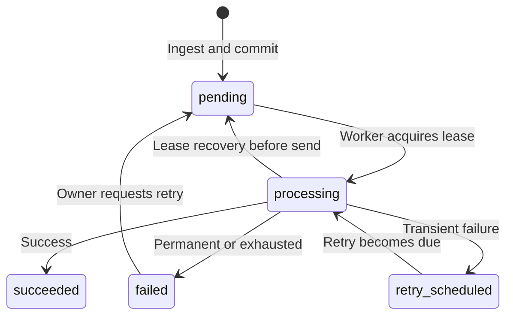

# Event lifecycle

Status: Proposed

## Principles

- PostgreSQL holds authoritative state.
- A Celery task is permission to look for work, not proof that work exists.
- Attempt history is append-only.
- State transitions and attempt creation are committed transactionally where possible.
- A lease has an expiry so a crashed worker cannot own an event forever.

## Proposed event states

| State | Meaning |
|---|---|
| `pending` | Persisted and awaiting its first delivery attempt |
| `processing` | Leased by a worker for one delivery attempt |
| `retry_scheduled` | Last attempt was transiently unsuccessful; another is due later |
| `succeeded` | Destination returned an accepted success response |
| `failed` | Permanent failure or retry limit exhausted |

Terminal states are `succeeded` and `failed`, except that an owner may request a
manual retry from `failed`. A manual retry does not reset attempt history.

## State transitions



The `processing → pending` recovery arrow represents a job that can prove the
HTTP request was not started. If a crash may have occurred after transmission,
the result is uncertain and retrying preserves at-least-once, not exactly-once,
semantics.

## Attempt numbering

- `attempt_number` is monotonically increasing per event.
- `UNIQUE (event_id, attempt_number)` is enforced by PostgreSQL.
- Automatic and manual attempts share the same sequence.
- `trigger` records `automatic` or `manual`.

Allocation must happen while holding the event lock/lease so concurrent tasks
cannot intentionally assign the same number or start simultaneous calls.

## Retry classification

Retry automatically:

- connection failures;
- connect/read/write/pool timeouts;
- HTTP 429;
- HTTP 500, 502, 503, and 504;
- other 5xx only if the documented policy explicitly includes them.

Do not automatically retry:

- malformed destination configuration;
- SSRF validation failure;
- payload validation failure;
- HTTP 400, 401, 403, 404, 405, 409, and 422 by default;
- other explicit permanent errors.

HTTP 408 is intentionally left for architecture review because destinations
vary in whether it indicates a safe retry. HTTP 409 may be success-like for an
idempotent destination, but RelayMaid cannot assume that globally.

## Backoff

The initial proposal is capped exponential backoff with full jitter:

```text
maximum_delay = min(cap, base * 2 ** retry_index)
actual_delay = random(0, maximum_delay)
```

`Retry-After` may be honored for 429 and 503 if it parses correctly and remains
within configured limits. Exact defaults will be fixed before implementing the
retry module so tests can use deterministic injected randomness and clocks.

## Manual retry

- Allowed only to an owner.
- Valid initially only for `failed` events.
- Uses the event's destination and retry-policy snapshot.
- Creates a new outbox message and returns the event to `pending` atomically.
- Does not delete or modify earlier attempts.
- Concurrent manual-retry requests must collapse to one scheduled action.

## Open decisions before implementation

- Exact lease fields and whether attempt rows are created before or after the lease.
- Whether any 2xx is success, and how 3xx is classified with redirects disabled.
- Exact retry count meaning: total attempts versus retries after the first attempt.
- Concrete base delay, cap, jitter algorithm, and maximum `Retry-After`.
- Recovery representation for an uncertain outcome after the request was sent.

